#Macrobull's Configurations
==============

Macrobull is now coding with a Thinkpad x230 with openSUSE Tumbleweed + KDE.

KDE
----

* Kate Syntax Highlighting.

	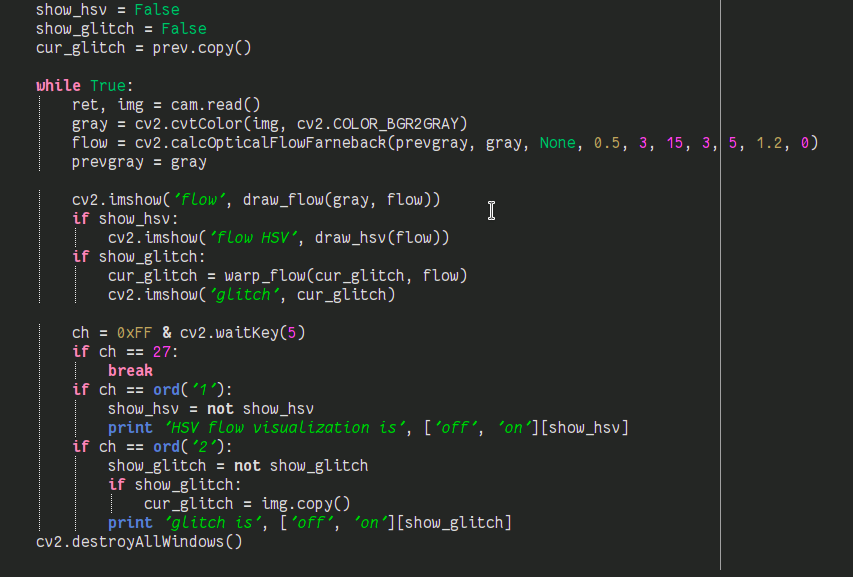

* Breeze themed Yakuake and Konsole profile.

	~~Comic sans~~ Fantasque Sans Mono as font, with multi-alpha Reimu or Flandre background.

	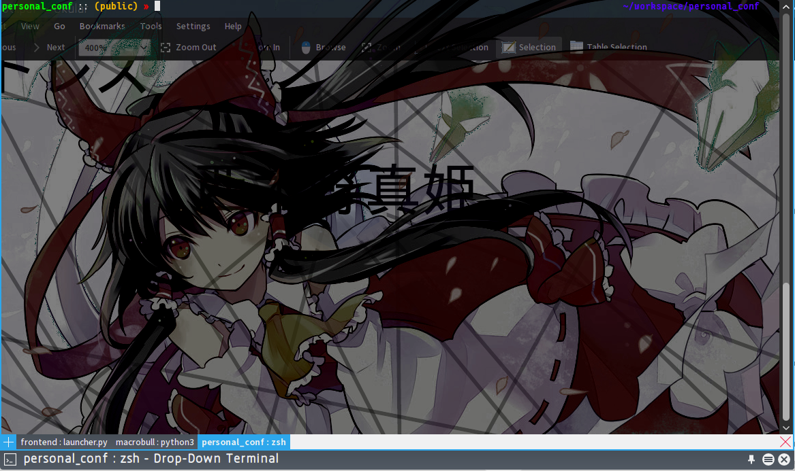
	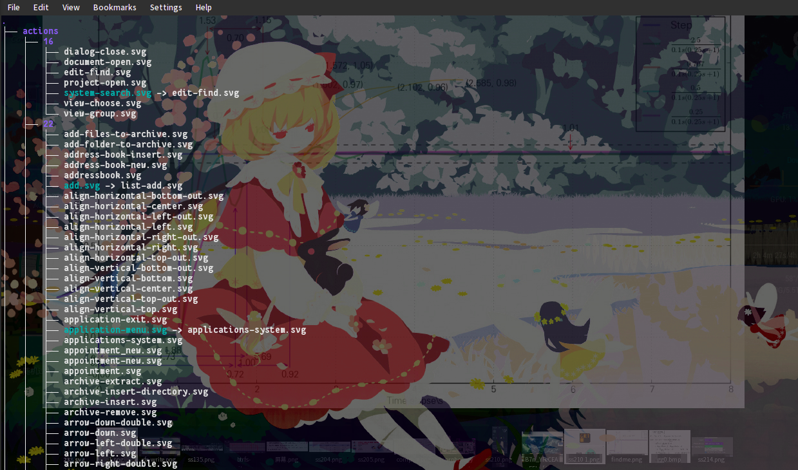

* Klipper configured for web content including Bilibili, Github and zim/markdown.

	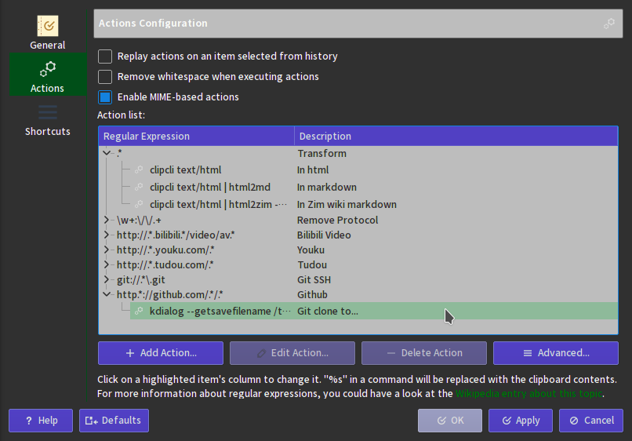

* KDE Color Scheme: dark but light textview.

	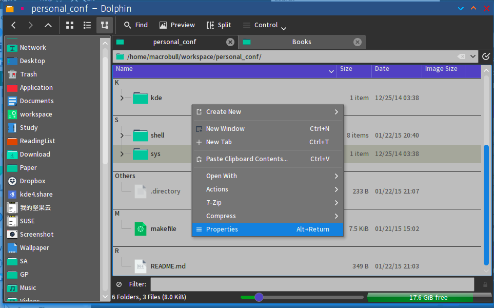

* Ksysguard extra panel for laptops.

	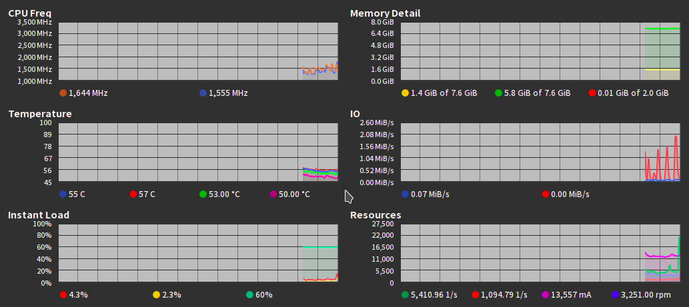


* And many xscreensavers configured in lowest fps...
* (more plasma-desktop widgets configurations?)

System configs
----
* Ready to use Snapper template and configs for root and user.
* Zypper configs with repos in **ZJU / Hangzhou, China**.
* Ready to use TLP configs for **Thinkpad x230**.
* Kernel mod configs for Thinkpad x230, work with thermal-daemon and i915 tweaks.
* Udev rules for embeded develops _ (:3JZ)_

App configs
----
* Python matplotlib themes.
	* Macrobull:
	
	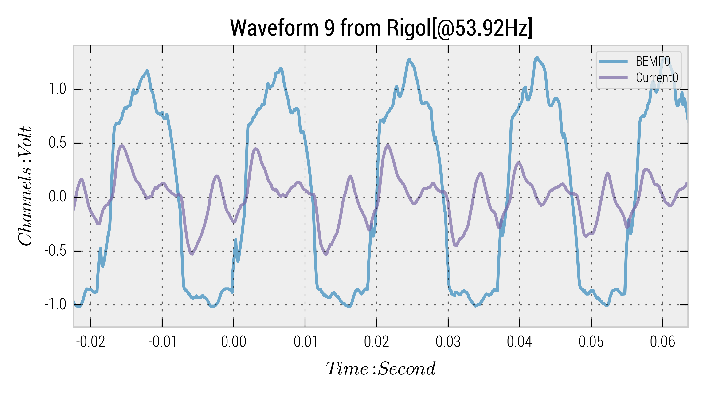
	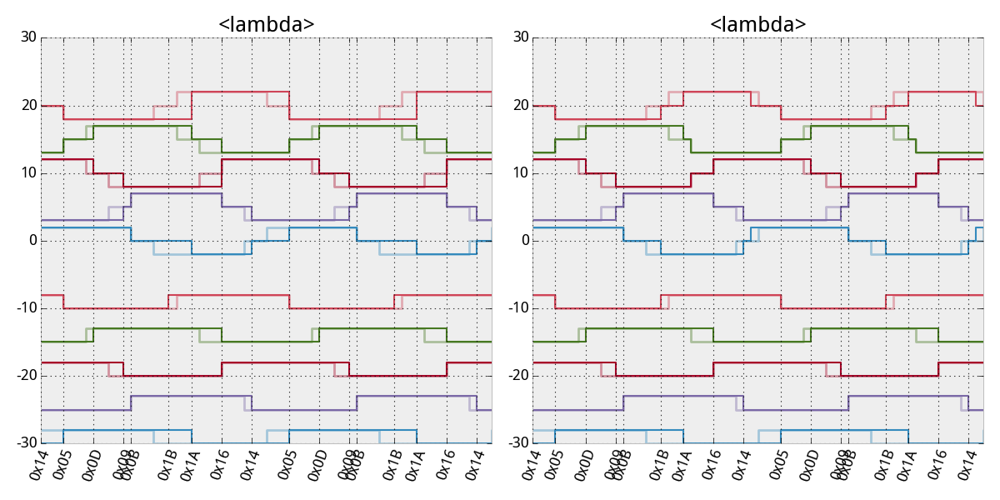
	* ggplot:
	
	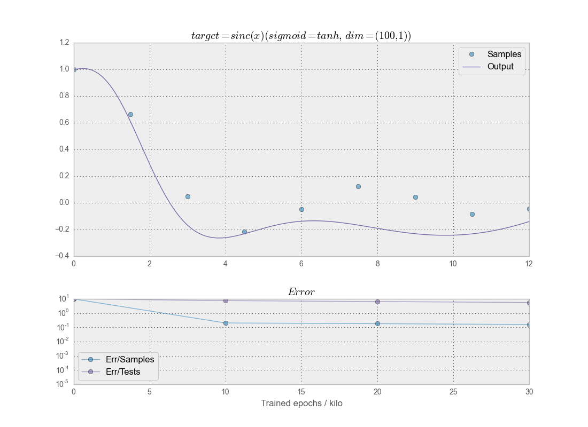
	* probpro:
	
	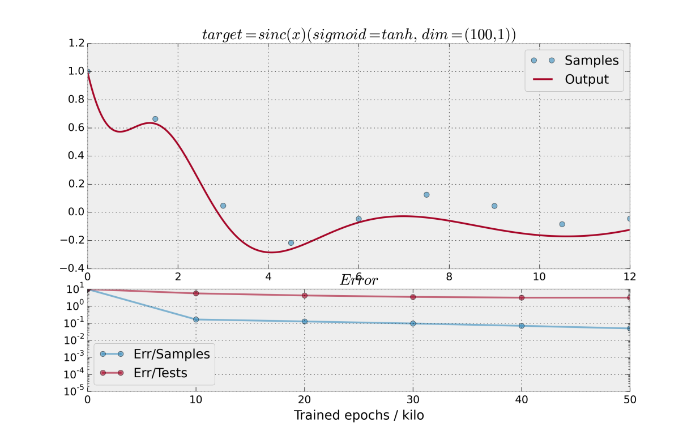
	* R:
	
	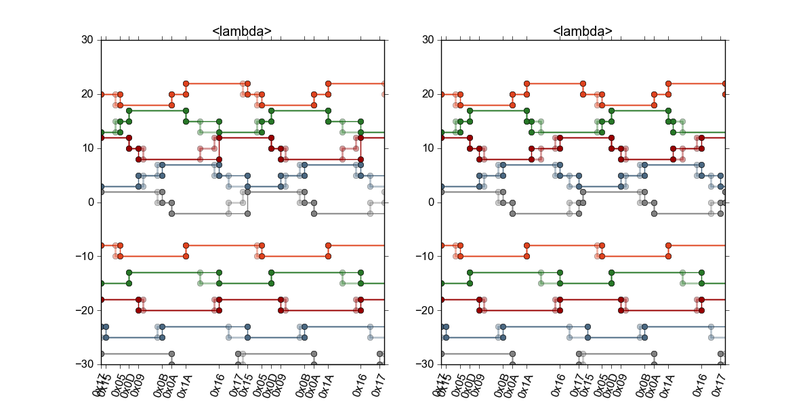

* QtCurve Theme and WM decoration.

	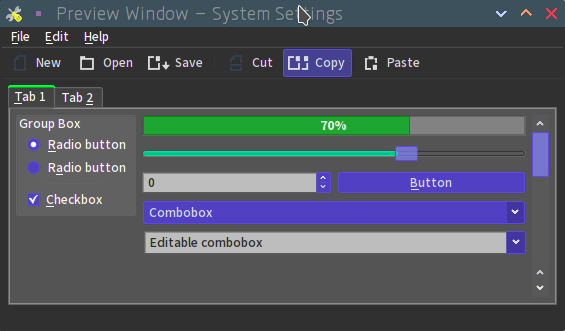

* Ready to use Zim Wiki configs.
* vaapi hw-accelerate configed mpv profile.
* Ready to use Spyder config.

	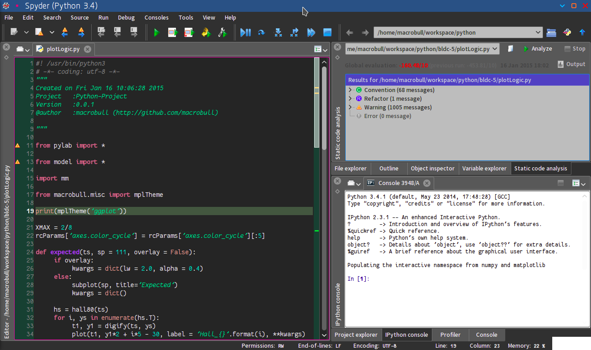

* .desktop files for:

	Maya, Baka-player, Gitbook, MdCharm, Mu
	
	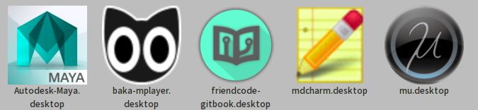
	
	QML2.desktop for "qmlscene -I . -I imports %f", help to run a qml with a click

* Conky with enhanced hardware info forked from [mariusv/conky-google-now](https://github.com/mariusv/conky-google-now).
	
	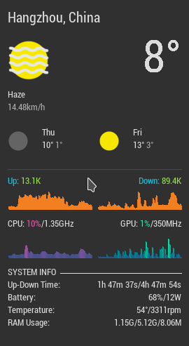

	(A extension of web image can be found in .conkyrc.bak)

Shell configs
----
Seperated configs for paths, alias, environments and compile defines, mainly optimized for openSUSE.

CC configs
----
~/.ccconfig: C compiler flags/parameters for gcc, clang, icc, opencc

Use load_xxx_flags to switch.

NoKDE hook
----

Many 3rd party software using Qt linked/packed Qt with it. Without distribution version of libqt, KDE theme will not be applied sucessfully however color scheme is applied(quite absurd). 

The solution is set env var "KDE_SESSION_VERSION=0" to make disable loading KDE settings, when setting cache exits, "sed -i 's/Palette\\active=.*/#Palette\\active/g' ~/.config/Trolltech.conf" to delete cached setting from Trolltech.conf.
This script is written as nokde.

To hook the launching command of a 'qt_app', place bin/.hook in the first position in $PATH and create a link to bin/.hook/nokde in the same name, i.e. bin/.hook/qt_app -> bin/.hook/nokde. To help the creation of the link, another script qt-kde (qt minus kde) is used.

Example:

```bash
> dropbox
(dropbox launched normally, KDE themed)
> nokde dropbox
(dropbox launched without kde theme)
> qt-kde dropbox
Launch /usr/bin/dropbox ...
(.hooks/dropbox created)
(dropbox launched without kde theme)
> dropbox
Launch /usr/bin/dropbox ...
(from .hooks/dropbox)
(dropbox launched without kde theme)
```
	

Scripts
----

* bullet
	
	Simple pushbullet cli tool.

* eth0mock

	Mock up a eth0 interface for no Ethernet card computers for MAC-managed license managers.

* fanctl
	
	Change Thinkpad fan mode.

* git-initfor

	git initfor python/ruby/.... create .gitignore  file for specific laguages.

* git-truncate
	
	Truncte git history, from http://web.archive.org/web/20130116195128/http://bogdan.org.ua/2011/03/28/how-to-truncate-git-history-sample-script-included.html .

* ympv
	
	Stream Youtube-dl + mpv, from mpv.io official repo .

